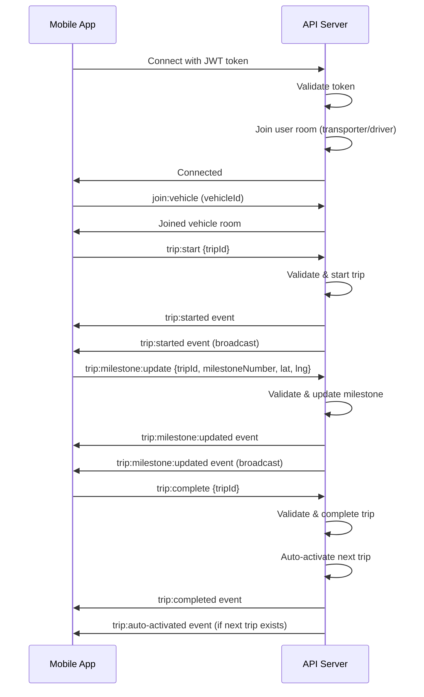

# Porttivo Transporter & Driver API - Complete Documentation

Complete API documentation for building Transporter and Driver mobile applications with all routes, request/response formats, Socket.IO events, and business logic.

## Table of Contents

1. [Base Configuration](#base-configuration)
2. [Authentication](#authentication)
3. [Transporter Endpoints](#transporter-endpoints)
4. [Driver Endpoints](#driver-endpoints)
5. [Vehicle Management](#vehicle-management)
6. [Trip Management](#trip-management)
7. [Socket.IO Real-Time Communication](#socketio-real-time-communication)
8. [Data Models](#data-models)
9. [Business Logic & Rules](#business-logic--rules)
10. [Error Handling](#error-handling)

---

## Base Configuration

### Base URL
```
http://localhost:3000/api
```

### Authentication Header
For all protected endpoints, include the JWT token in the Authorization header:
```
Authorization: Bearer <access_token>
```

### Response Format
All API responses follow this structure:
```json
{
  "success": true|false,
  "message": "Response message",
  "data": { ... }
}
```

### Error Response Format
```json
{
  "success": false,
  "message": "Error message",
  "error": "Detailed error information (optional)"
}
```

---

## Authentication

### 1. Register Transporter

**POST** `/api/auth/register`

Register a new transporter account.

**Access**: Public

**Request Body:**
```json
{
  "mobile": "9876543210",
  "name": "John Doe",
  "email": "john@example.com",
  "company": "ABC Transport"
}
```

**Response** (201 Created):
```json
{
  "success": true,
  "message": "Registration successful",
  "data": {
    "accessToken": "jwt-access-token",
    "refreshToken": "jwt-refresh-token",
    "user": {
      "id": "transporter-id",
      "mobile": "9876543210",
      "name": "John Doe",
      "email": "john@example.com",
      "company": "ABC Transport",
      "userType": "transporter",
      "status": "pending",
      "hasAccess": false,
      "hasPinSet": false
    }
  }
}
```

**Error Responses:**
- `400` - Missing required fields or invalid format
- `409` - Transporter with mobile number already exists

---

### 2. Send OTP (Login)

**POST** `/api/auth/send-otp`

Login with mobile number (simplified OTP flow - returns tokens directly).

**Access**: Public

**Request Body:**
```json
{
  "mobile": "9876543210",
  "userType": "transporter" | "driver"
}
```

**Response** (200 OK):
```json
{
  "success": true,
  "message": "Login successful",
  "data": {
    "accessToken": "jwt-access-token",
    "refreshToken": "jwt-refresh-token",
    "user": {
      "id": "user-id",
      "mobile": "9876543210",
      "name": "User Name",
      "userType": "transporter" | "driver",
      "status": "active",
      "hasPinSet": true
    }
  }
}
```

**Error Responses:**
- `400` - Invalid mobile number or user type
- `404` - Transporter not registered (for transporter)
- `403` - Account blocked

**Notes:**
- For drivers: If driver doesn't exist, it will be auto-created with status "pending"
- For transporters: Must be pre-registered

---

### 3. PIN Login (Transporter Only)

**POST** `/api/auth/pin-login`

Login with 4-digit PIN (faster login for transporters).

**Access**: Public

**Request Body:**
```json
{
  "mobile": "9876543210",
  "pin": "1234"
}
```

**Response** (200 OK):
```json
{
  "success": true,
  "message": "Login successful",
  "data": {
    "accessToken": "jwt-access-token",
    "refreshToken": "jwt-refresh-token",
    "user": {
      "id": "transporter-id",
      "mobile": "9876543210",
      "name": "John Doe",
      "userType": "transporter",
      "status": "active",
      "hasPinSet": true
    }
  }
}
```

**Error Responses:**
- `400` - PIN must be 4 digits or PIN not set
- `401` - Invalid PIN
- `404` - Transporter not found

---

### 4. Refresh Token

**POST** `/api/auth/refresh`

Refresh access token using refresh token.

**Access**: Public

**Request Body:**
```json
{
  "refreshToken": "jwt-refresh-token"
}
```

**Response** (200 OK):
```json
{
  "success": true,
  "message": "Token refreshed successfully",
  "data": {
    "accessToken": "new-jwt-access-token",
    "refreshToken": "new-jwt-refresh-token"
  }
}
```

**Error Responses:**
- `400` - Refresh token required
- `401` - Invalid or expired refresh token

---

## Transporter Endpoints

### 1. Get Profile

**GET** `/api/transporters/profile`

Get authenticated transporter's profile.

**Access**: Private (Transporter only)

**Headers:**
```
Authorization: Bearer <access_token>
```

**Response** (200 OK):
```json
{
  "success": true,
  "message": "Profile retrieved successfully",
  "data": {
    "transporter": {
      "id": "transporter-id",
      "mobile": "9876543210",
      "name": "John Doe",
      "email": "john@example.com",
      "company": "ABC Transport",
      "status": "active",
      "hasAccess": true,
      "hasPinSet": true,
      "walletBalance": 5000.00,
      "createdAt": "2024-01-01T00:00:00.000Z",
      "updatedAt": "2024-01-01T00:00:00.000Z"
    }
  }
}
```

---

### 2. Update Profile

**PUT** `/api/transporters/profile`

Update transporter profile information.

**Access**: Private (Transporter only)

**Request Body:**
```json
{
  "name": "John Doe Updated",
  "email": "john.updated@example.com",
  "company": "ABC Transport Ltd"
}
```

**Response** (200 OK):
```json
{
  "success": true,
  "message": "Profile updated successfully",
  "data": {
    "transporter": {
      "id": "transporter-id",
      "mobile": "9876543210",
      "name": "John Doe Updated",
      "email": "john.updated@example.com",
      "company": "ABC Transport Ltd",
      "status": "active",
      "hasAccess": true,
      "hasPinSet": true,
      "walletBalance": 5000.00
    }
  }
}
```

---

### 3. Set PIN

**PUT** `/api/transporters/set-pin`

Set or update 4-digit PIN for transporter.

**Access**: Private (Transporter only)

**Request Body:**
```json
{
  "pin": "1234"
}
```

**Response** (200 OK):
```json
{
  "success": true,
  "message": "PIN set successfully",
  "data": {
    "hasPinSet": true
  }
}
```

**Error Responses:**
- `400` - PIN must be 4 digits

---

### 4. Get Dashboard Stats

**GET** `/api/transporters/dashboard`

Get transporter dashboard statistics.

**Access**: Private (Transporter only)

**Response** (200 OK):
```json
{
  "success": true,
  "message": "Dashboard stats retrieved successfully",
  "data": {
    "dashboard": {
      "totalVehicles": 15,
      "totalDrivers": 8,
      "activeTripsCount": 3,
      "queuedTripsCount": 5,
      "pendingPODCount": 2,
      "todaysTripsCount": 12
    }
  }
}
```

---

## Driver Endpoints

### 1. Get Profile

**GET** `/api/drivers/profile`

Get authenticated driver's profile.

**Access**: Private (Driver only)

**Response** (200 OK):
```json
{
  "success": true,
  "message": "Profile retrieved successfully",
  "data": {
    "driver": {
      "id": "driver-id",
      "mobile": "9876543211",
      "name": "Driver Name",
      "transporterId": "transporter-id",
      "transporter": {
        "id": "transporter-id",
        "name": "John Doe",
        "company": "ABC Transport",
        "mobile": "9876543210"
      },
      "status": "active",
      "riskLevel": "low",
      "language": "en",
      "walletBalance": 1000.00,
      "createdAt": "2024-01-01T00:00:00.000Z",
      "updatedAt": "2024-01-01T00:00:00.000Z"
    }
  }
}
```

---

### 2. Update Profile

**PUT** `/api/drivers/profile`

Update driver profile.

**Access**: Private (Driver only)

**Request Body:**
```json
{
  "name": "Updated Driver Name"
}
```

**Response** (200 OK):
```json
{
  "success": true,
  "message": "Profile updated successfully",
  "data": {
    "driver": {
      "id": "driver-id",
      "mobile": "9876543211",
      "name": "Updated Driver Name",
      "status": "active",
      "riskLevel": "low",
      "language": "en",
      "walletBalance": 1000.00
    }
  }
}
```

---

### 3. Update Language Preference

**PUT** `/api/drivers/language`

Update driver language preference.

**Access**: Private (Driver only)

**Request Body:**
```json
{
  "language": "en" | "hi" | "mr"
}
```

**Response** (200 OK):
```json
{
  "success": true,
  "message": "Language preference updated successfully",
  "data": {
    "driver": {
      "id": "driver-id",
      "mobile": "9876543211",
      "name": "Driver Name",
      "language": "hi"
    }
  }
}
```

---

### 4. Get Active Trip

**GET** `/api/drivers/trips/active`

Get active trip assigned to driver.

**Access**: Private (Driver only)

**Response** (200 OK):
```json
{
  "success": true,
  "message": "Active trip retrieved successfully",
  "data": {
    "trip": {
      "tripId": "TRIP-2024-001",
      "id": "trip-id",
      "transporterId": "transporter-id",
      "vehicleId": "vehicle-id",
      "driverId": "driver-id",
      "containerNumber": "CONTAINER123",
      "reference": "REF-001",
      "pickupLocation": {
        "address": "Port Mumbai",
        "coordinates": {
          "latitude": 19.0760,
          "longitude": 72.8777
        }
      },
      "dropLocation": {
        "address": "Factory Pune",
        "coordinates": {
          "latitude": 18.5204,
          "longitude": 73.8567
        }
      },
      "tripType": "IMPORT",
      "status": "ACTIVE",
      "milestones": [
        {
          "milestoneType": "CONTAINER_PICKED",
          "milestoneNumber": 1,
          "timestamp": "2024-01-01T10:00:00.000Z",
          "location": {
            "latitude": 19.0760,
            "longitude": 72.8777
          },
          "photo": "/uploads/milestones/photo1.jpg",
          "driverId": "driver-id",
          "backendMeaning": "Container picked from port"
        }
      ],
      "currentMilestone": {
        "milestoneNumber": 2,
        "milestoneType": "REACHED_LOCATION"
      },
      "vehicleId": {
        "vehicleNumber": "MH12AB1234",
        "trailerType": "20ft"
      },
      "transporterId": {
        "name": "John Doe",
        "company": "ABC Transport"
      },
      "createdAt": "2024-01-01T00:00:00.000Z",
      "updatedAt": "2024-01-01T10:00:00.000Z"
    }
  }
}
```

**If no active trip:**
```json
{
  "success": true,
  "message": "No active trip found",
  "data": {
    "trip": null
  }
}
```

---

### 5. Get Queued Trips

**GET** `/api/drivers/trips/queued`

Get queued trips assigned to driver.

**Access**: Private (Driver only)

**Response** (200 OK):
```json
{
  "success": true,
  "message": "Queued trips retrieved successfully",
  "data": {
    "trips": [
      {
        "tripId": "TRIP-2024-002",
        "id": "trip-id-2",
        "containerNumber": "CONTAINER456",
        "reference": "REF-002",
        "tripType": "EXPORT",
        "status": "PLANNED",
        "vehicleId": {
          "vehicleNumber": "MH12AB1234",
          "trailerType": "20ft"
        },
        "transporterId": {
          "name": "John Doe",
          "company": "ABC Transport"
        }
      }
    ],
    "count": 1
  }
}
```

---

### 6. Get Trip History

**GET** `/api/drivers/trips/history`

Get trip history for driver.

**Access**: Private (Driver only)

**Query Parameters:**
- `page` (optional) - Page number (default: 1)
- `limit` (optional) - Items per page (default: 20)
- `status` (optional) - Filter by status: `COMPLETED`, `POD_PENDING`, `CANCELLED`

**Response** (200 OK):
```json
{
  "success": true,
  "message": "Trip history retrieved successfully",
  "data": {
    "trips": [
      {
        "tripId": "TRIP-2024-001",
        "id": "trip-id",
        "containerNumber": "CONTAINER123",
        "status": "COMPLETED",
        "milestones": [...],
        "POD": {
          "photo": "/uploads/pod/pod1.jpg",
          "uploadedAt": "2024-01-01T15:00:00.000Z",
          "approvedAt": "2024-01-01T16:00:00.000Z"
        }
      }
    ],
    "pagination": {
      "page": 1,
      "limit": 20,
      "total": 50,
      "pages": 3
    }
  }
}
```

---

### 7. Get Drivers by Transporter (Transporter Access)

**GET** `/api/drivers/transporter/:transporterId`

Get all drivers for a transporter.

**Access**: Private (Transporter only)

**Response** (200 OK):
```json
{
  "success": true,
  "message": "Drivers retrieved successfully",
  "data": {
    "drivers": [
      {
        "id": "driver-id",
        "mobile": "9876543211",
        "name": "Driver Name",
        "status": "active",
        "riskLevel": "low",
        "language": "en",
        "walletBalance": 1000.00,
        "createdAt": "2024-01-01T00:00:00.000Z",
        "updatedAt": "2024-01-01T00:00:00.000Z"
      }
    ],
    "count": 1
  }
}
```

---

### 8. Create Driver (Transporter Access)

**POST** `/api/drivers`

Create a new driver.

**Access**: Private (Transporter only)

**Request Body:**
```json
{
  "mobile": "9876543211",
  "name": "Driver Name",
  "status": "pending" | "active" | "inactive" | "blocked"
}
```

**Response** (201 Created):
```json
{
  "success": true,
  "message": "Driver created successfully",
  "data": {
    "driver": {
      "id": "driver-id",
      "mobile": "9876543211",
      "name": "Driver Name",
      "transporterId": "transporter-id",
      "status": "pending",
      "riskLevel": "low",
      "language": "en",
      "walletBalance": 0
    }
  }
}
```

---

### 9. Update Driver (Transporter Access)

**PUT** `/api/drivers/:id`

Update driver information.

**Access**: Private (Transporter only)

**Request Body:**
```json
{
  "name": "Updated Driver Name",
  "status": "active"
}
```

**Response** (200 OK):
```json
{
  "success": true,
  "message": "Driver updated successfully",
  "data": {
    "driver": {
      "id": "driver-id",
      "mobile": "9876543211",
      "name": "Updated Driver Name",
      "status": "active"
    }
  }
}
```

---

### 10. Delete Driver (Transporter Access)

**DELETE** `/api/drivers/:id`

Delete a driver (only if no active trips).

**Access**: Private (Transporter only)

**Response** (200 OK):
```json
{
  "success": true,
  "message": "Driver deleted successfully"
}
```

**Error Responses:**
- `400` - Driver has active trip, cannot delete
- `404` - Driver not found

---

## Vehicle Management

### 1. List Vehicles

**GET** `/api/vehicles`

Get all vehicles for authenticated transporter.

**Access**: Private (Transporter only)

**Query Parameters:**
- `status` (optional) - Filter by status: `active`, `inactive`
- `ownerType` (optional) - Filter by owner type: `OWN`, `HIRED`
- `driverId` (optional) - Filter by driver ID

**Response** (200 OK):
```json
{
  "success": true,
  "message": "Vehicles retrieved successfully",
  "data": {
    "vehicles": [
      {
        "id": "vehicle-id",
        "vehicleNumber": "MH12AB1234",
        "transporterId": "transporter-id",
        "ownerType": "OWN",
        "originalOwnerId": null,
        "driverId": "driver-id",
        "driver": {
          "id": "driver-id",
          "name": "Driver Name",
          "mobile": "9876543211",
          "status": "active"
        },
        "status": "active",
        "trailerType": "20ft",
        "documents": {
          "rc": {
            "url": "/uploads/vehicles/rc_vehicle-id.pdf",
            "expiryDate": "2025-12-31T00:00:00.000Z",
            "uploadedAt": "2024-01-01T00:00:00.000Z"
          },
          "insurance": null,
          "fitness": null,
          "permit": null
        },
        "hiredBy": [],
        "createdAt": "2024-01-01T00:00:00.000Z",
        "updatedAt": "2024-01-01T00:00:00.000Z"
      }
    ],
    "count": 1
  }
}
```

---

### 2. Create Vehicle

**POST** `/api/vehicles`

Create a new vehicle.

**Access**: Private (Transporter only)

**Request Body:**
```json
{
  "vehicleNumber": "MH12AB1234",
  "ownerType": "OWN" | "HIRED",
  "driverId": "driver-id",
  "trailerType": "20ft"
}
```

**Response** (201 Created):
```json
{
  "success": true,
  "message": "Vehicle created successfully",
  "data": {
    "vehicle": {
      "id": "vehicle-id",
      "vehicleNumber": "MH12AB1234",
      "transporterId": "transporter-id",
      "ownerType": "OWN",
      "originalOwnerId": "transporter-id",
      "driverId": "driver-id",
      "driver": {
        "id": "driver-id",
        "name": "Driver Name",
        "mobile": "9876543211",
        "status": "active"
      },
      "status": "active",
      "trailerType": "20ft",
      "documents": {},
      "hiredBy": [],
      "createdAt": "2024-01-01T00:00:00.000Z",
      "updatedAt": "2024-01-01T00:00:00.000Z"
    }
  }
}
```

**Error Responses:**
- `400` - Vehicle number already exists as OWN
- `400` - Invalid owner type

**Business Rules:**
- OWN vehicles: vehicleNumber must be unique globally
- HIRED vehicles: Same vehicleNumber can exist for multiple transporters
- For OWN vehicles, originalOwnerId is automatically set to transporterId

---

### 3. Get Vehicle by ID

**GET** `/api/vehicles/:id`

Get vehicle details by ID.

**Access**: Private

**Response** (200 OK):
```json
{
  "success": true,
  "message": "Vehicle retrieved successfully",
  "data": {
    "vehicle": {
      "id": "vehicle-id",
      "vehicleNumber": "MH12AB1234",
      "transporterId": "transporter-id",
      "ownerType": "OWN",
      "driverId": "driver-id",
      "driver": {
        "id": "driver-id",
        "name": "Driver Name",
        "mobile": "9876543211",
        "status": "active"
      },
      "status": "active",
      "trailerType": "20ft",
      "documents": {...},
      "hiredBy": [],
      "createdAt": "2024-01-01T00:00:00.000Z",
      "updatedAt": "2024-01-01T00:00:00.000Z"
    }
  }
}
```

---

### 4. Update Vehicle

**PUT** `/api/vehicles/:id`

Update vehicle information.

**Access**: Private (Transporter only)

**Request Body:**
```json
{
  "driverId": "new-driver-id",
  "status": "active" | "inactive",
  "trailerType": "40ft"
}
```

**Response** (200 OK):
```json
{
  "success": true,
  "message": "Vehicle updated successfully",
  "data": {
    "vehicle": {
      "id": "vehicle-id",
      "vehicleNumber": "MH12AB1234",
      "driverId": "new-driver-id",
      "status": "active",
      "trailerType": "40ft"
    }
  }
}
```

---

### 5. Delete Vehicle

**DELETE** `/api/vehicles/:id`

Delete a vehicle (only if no trip history).

**Access**: Private (Transporter only)

**Response** (200 OK):
```json
{
  "success": true,
  "message": "Vehicle deleted successfully"
}
```

**Error Responses:**
- `400` - Vehicle has trip history, cannot delete (mark as inactive instead)

---

### 6. Get Vehicle Trip History

**GET** `/api/vehicles/:id/trips`

Get all trips for a vehicle.

**Access**: Private

**Response** (200 OK):
```json
{
  "success": true,
  "message": "Vehicle trips retrieved successfully",
  "data": {
    "trips": [
      {
        "tripId": "TRIP-2024-001",
        "id": "trip-id",
        "containerNumber": "CONTAINER123",
        "status": "COMPLETED",
        "createdAt": "2024-01-01T00:00:00.000Z"
      }
    ],
    "count": 1
  }
}
```

---

### 7. Get Vehicle Availability

**GET** `/api/vehicles/:id/availability`

Get vehicle availability status and queue information.

**Access**: Private

**Response** (200 OK):
```json
{
  "success": true,
  "message": "Vehicle availability retrieved successfully",
  "data": {
    "vehicleId": "vehicle-id",
    "status": "active",
    "hasActiveTrip": true,
    "activeTrip": {
      "tripId": "TRIP-2024-001",
      "id": "trip-id",
      "status": "ACTIVE"
    },
    "queuedTrips": 3,
    "canCreateTrip": false,
    "message": "Vehicle has active trip"
  }
}
```

**Availability States:**
- `AVAILABLE` - No active trip, can create new trip
- `ACTIVE` - Has active trip, cannot create new trip
- `QUEUED` - Has queued trips, can create more trips (will be queued)

---

### 8. Upload Vehicle Document

**POST** `/api/vehicles/:id/documents`

Upload vehicle document (RC, Insurance, Fitness, Permit).

**Access**: Private (Transporter only)

**Content-Type**: `multipart/form-data` or `application/json`

**Request Body (JSON):**
```json
{
  "documentType": "rc" | "insurance" | "fitness" | "permit",
  "url": "/uploads/vehicles/document.pdf",
  "expiryDate": "2025-12-31T00:00:00.000Z"
}
```

**Request Body (Form Data):**
- `documentType` (required) - `rc`, `insurance`, `fitness`, `permit`
- `file` (required) - Document file (if using multipart)
- `expiryDate` (optional) - Document expiry date (ISO format)

**Response** (200 OK):
```json
{
  "success": true,
  "message": "Document uploaded successfully",
  "data": {
    "document": {
      "type": "rc",
      "url": "/uploads/vehicles/rc_vehicle-id.pdf",
      "expiryDate": "2025-12-31T00:00:00.000Z",
      "uploadedAt": "2024-01-01T00:00:00.000Z"
    }
  }
}
```

---

### 9. Get Vehicle Documents

**GET** `/api/vehicles/:id/documents`

Get all documents for a vehicle.

**Access**: Private

**Response** (200 OK):
```json
{
  "success": true,
  "message": "Documents retrieved successfully",
  "data": {
    "documents": {
      "rc": {
        "url": "/uploads/vehicles/rc_vehicle-id.pdf",
        "expiryDate": "2025-12-31T00:00:00.000Z",
        "uploadedAt": "2024-01-01T00:00:00.000Z"
      },
      "insurance": null,
      "fitness": null,
      "permit": null
    }
  }
}
```

---

## Trip Management

### 1. Create Trip

**POST** `/api/trips`

Create a new trip.

**Access**: Private (Transporter only)

**Request Body:**
```json
{
  "containerNumber": "CONTAINER123",
  "reference": "REF-001",
  "tripType": "IMPORT" | "EXPORT",
  "pickupLocation": {
    "address": "Port Mumbai",
    "coordinates": {
      "latitude": 19.0760,
      "longitude": 72.8777
    }
  },
  "dropLocation": {
    "address": "Factory Pune",
    "coordinates": {
      "latitude": 18.5204,
      "longitude": 73.8567
    }
  },
  "vehicleId": "vehicle-id",
  "driverId": "driver-id"
}
```

**Response** (201 Created):
```json
{
  "success": true,
  "message": "Trip created successfully",
  "data": {
    "tripId": "TRIP-2024-001",
    "id": "trip-id",
    "transporterId": "transporter-id",
    "vehicleId": {
      "vehicleNumber": "MH12AB1234",
      "trailerType": "20ft"
    },
    "driverId": {
      "name": "Driver Name",
      "mobile": "9876543211"
    },
    "containerNumber": "CONTAINER123",
    "reference": "REF-001",
    "pickupLocation": {
      "address": "Port Mumbai",
      "coordinates": {
        "latitude": 19.0760,
        "longitude": 72.8777
      }
    },
    "dropLocation": {
      "address": "Factory Pune",
      "coordinates": {
        "latitude": 18.5204,
        "longitude": 73.8567
      }
    },
    "tripType": "IMPORT",
    "status": "PLANNED",
    "milestones": [],
    "POD": {},
    "createdAt": "2024-01-01T00:00:00.000Z",
    "updatedAt": "2024-01-01T00:00:00.000Z"
  }
}
```

**Error Responses:**
- `400` - Trip type is required and must be IMPORT or EXPORT
- `400` - Vehicle is not active
- `400` - Pickup/drop location must include coordinates
- `403` - You do not have access to this vehicle
- `404` - Vehicle or driver not found

**Business Rules:**
- Trip is created with status: PLANNED
- If vehicle/driver assigned, trip is queued for that vehicle
- Multiple trips can be queued per vehicle
- vehicleId and driverId are optional (can be assigned later)

---

### 2. List Trips

**GET** `/api/trips`

Get all trips for authenticated transporter.

**Access**: Private (Transporter only)

**Query Parameters:**
- `status` (optional) - Filter by status: `PLANNED`, `ACTIVE`, `COMPLETED`, `POD_PENDING`, `CANCELLED`
- `vehicleId` (optional) - Filter by vehicle ID
- `driverId` (optional) - Filter by driver ID
- `tripType` (optional) - Filter by trip type: `IMPORT`, `EXPORT`
- `page` (optional) - Page number (default: 1)
- `limit` (optional) - Items per page (default: 20)
- `startDate` (optional) - Filter trips from date (ISO format)
- `endDate` (optional) - Filter trips to date (ISO format)

**Response** (200 OK):
```json
{
  "success": true,
  "data": [
    {
      "tripId": "TRIP-2024-001",
      "id": "trip-id",
      "transporterId": "transporter-id",
      "vehicleId": {
        "vehicleNumber": "MH12AB1234",
        "trailerType": "20ft"
      },
      "driverId": {
        "name": "Driver Name",
        "mobile": "9876543211"
      },
      "containerNumber": "CONTAINER123",
      "reference": "REF-001",
      "tripType": "IMPORT",
      "status": "ACTIVE",
      "milestones": [...],
      "POD": {},
      "createdAt": "2024-01-01T00:00:00.000Z",
      "updatedAt": "2024-01-01T00:00:00.000Z"
    }
  ],
  "pagination": {
    "page": 1,
    "limit": 20,
    "total": 50,
    "pages": 3
  }
}
```

---

### 3. Get Active Trips

**GET** `/api/trips/active`

Get all active trips for transporter.

**Access**: Private (Transporter only)

**Response** (200 OK):
```json
{
  "success": true,
  "message": "Active trips retrieved successfully",
  "data": {
    "trips": [
      {
        "tripId": "TRIP-2024-001",
        "id": "trip-id",
        "status": "ACTIVE",
        "containerNumber": "CONTAINER123",
        "vehicleId": {...},
        "driverId": {...}
      }
    ],
    "count": 1
  }
}
```

---

### 4. Get Pending POD Trips

**GET** `/api/trips/pending-pod`

Get trips pending POD approval.

**Access**: Private (Transporter only)

**Query Parameters:**
- `page` (optional) - Page number (default: 1)
- `limit` (optional) - Items per page (default: 20)

**Response** (200 OK):
```json
{
  "success": true,
  "message": "Pending POD trips retrieved successfully",
  "data": {
    "trips": [
      {
        "tripId": "TRIP-2024-001",
        "id": "trip-id",
        "status": "POD_PENDING",
        "containerNumber": "CONTAINER123",
        "POD": {
          "photo": "/uploads/pod/pod1.jpg",
          "uploadedAt": "2024-01-01T15:00:00.000Z",
          "uploadedBy": {
            "name": "Driver Name",
            "mobile": "9876543211"
          }
        }
      }
    ],
    "pagination": {
      "page": 1,
      "limit": 20,
      "total": 2,
      "pages": 1
    }
  }
}
```

---

### 5. Get Trip by ID

**GET** `/api/trips/:id`

Get trip details by ID.

**Access**: Private

**Response** (200 OK):
```json
{
  "success": true,
  "message": "Trip retrieved successfully",
  "data": {
    "trip": {
      "tripId": "TRIP-2024-001",
      "id": "trip-id",
      "transporterId": "transporter-id",
      "vehicleId": {
        "vehicleNumber": "MH12AB1234",
        "trailerType": "20ft"
      },
      "driverId": {
        "name": "Driver Name",
        "mobile": "9876543211"
      },
      "containerNumber": "CONTAINER123",
      "reference": "REF-001",
      "pickupLocation": {...},
      "dropLocation": {...},
      "tripType": "IMPORT",
      "status": "ACTIVE",
      "milestones": [...],
      "POD": {},
      "createdAt": "2024-01-01T00:00:00.000Z",
      "updatedAt": "2024-01-01T00:00:00.000Z"
    }
  }
}
```

---

### 6. Update Trip

**PUT** `/api/trips/:id`

Update trip information (vehicle/driver change allowed before start).

**Access**: Private (Transporter only)

**Request Body:**
```json
{
  "vehicleId": "new-vehicle-id",
  "driverId": "new-driver-id",
  "containerNumber": "CONTAINER456",
  "reference": "REF-002",
  "pickupLocation": {...},
  "dropLocation": {...}
}
```

**Response** (200 OK):
```json
{
  "success": true,
  "message": "Trip updated successfully",
  "data": {
    "trip": {...}
  }
}
```

**Error Responses:**
- `400` - Trip cannot be updated. Current status: ACTIVE (only PLANNED trips can be updated)

---

### 7. Cancel Trip

**PUT** `/api/trips/:id/cancel`

Cancel a trip.

**Access**: Private (Transporter only)

**Response** (200 OK):
```json
{
  "success": true,
  "message": "Trip cancelled successfully",
  "data": {
    "trip": {
      "tripId": "TRIP-2024-001",
      "status": "CANCELLED"
    }
  }
}
```

**Error Responses:**
- `400` - Trip cannot be cancelled. Current status: ACTIVE (only PLANNED trips can be cancelled)

---

### 8. Start Trip

**PUT** `/api/trips/:id/start`

Start a trip (changes status from PLANNED to ACTIVE).

**Access**: Private (Transporter or Driver)

**Response** (200 OK):
```json
{
  "success": true,
  "message": "Trip started successfully",
  "data": {
    "tripId": "TRIP-2024-001",
    "id": "trip-id",
    "status": "ACTIVE",
    "currentMilestone": {
      "milestoneNumber": 1,
      "milestoneType": "CONTAINER_PICKED",
      "label": "Container Picked"
    },
    "vehicleId": {...},
    "driverId": {...},
    "transporterId": {...}
  }
}
```

**Error Responses:**
- `400` - Trip cannot be started. Current status: ACTIVE
- `400` - Vehicle already has an active trip
- `400` - Vehicle is not active

**Business Rules:**
- Only one ACTIVE trip per vehicle at a time
- Trip must be in PLANNED status
- Vehicle must be active
- Driver or Transporter can start the trip

**Socket.IO Event Emitted:**
- `trip:started` - Emitted to transporter, driver, vehicle, and trip rooms

---

### 9. Complete Trip

**PUT** `/api/trips/:id/complete`

Complete a trip (all 5 milestones must be completed).

**Access**: Private (Driver only)

**Response** (200 OK):
```json
{
  "success": true,
  "message": "Trip completed successfully",
  "data": {
    "trip": {
      "tripId": "TRIP-2024-001",
      "status": "COMPLETED",
      "milestones": [...]
    },
    "nextTrip": {
      "tripId": "TRIP-2024-002",
      "status": "ACTIVE",
      "message": "Next trip auto-activated"
    }
  }
}
```

**Error Responses:**
- `400` - All 5 milestones must be completed before completing the trip
- `400` - Trip cannot be completed. Current status: PLANNED

**Business Rules:**
- All 5 milestones must be completed
- Trip status changes to COMPLETED
- Auto-activates next queued trip for the same vehicle (if any)
- Emits Socket.IO events for trip completion and auto-activation

**Socket.IO Events Emitted:**
- `trip:completed` - Emitted to transporter, vehicle, and trip rooms
- `trip:auto-activated` - Emitted to driver and transporter (if next trip activated)

---

### 10. Update Milestone

**POST** `/api/trips/:id/milestones/:milestoneNumber`

Update trip milestone (Driver only).

**Access**: Private (Driver only)

**Content-Type**: `multipart/form-data` or `application/json`

**Path Parameters:**
- `id` - Trip ID
- `milestoneNumber` - Milestone number (1-5)

**Request Body (JSON):**
```json
{
  "latitude": 19.0760,
  "longitude": 72.8777,
  "photo": "base64-encoded-image" // Optional for milestone 1, required for others
}
```

**Request Body (Form Data):**
- `latitude` (required) - GPS latitude
- `longitude` (required) - GPS longitude
- `photo` (optional) - Milestone photo file
- `address` (optional) - Address string

**Response** (200 OK):
```json
{
  "success": true,
  "message": "Milestone updated successfully",
  "data": {
    "trip": {
      "tripId": "TRIP-2024-001",
      "milestones": [
        {
          "milestoneType": "CONTAINER_PICKED",
          "milestoneNumber": 1,
          "timestamp": "2024-01-01T10:00:00.000Z",
          "location": {
            "latitude": 19.0760,
            "longitude": 72.8777
          },
          "photo": "/uploads/milestones/milestone1.jpg",
          "driverId": "driver-id",
          "backendMeaning": "Container picked from port"
        }
      ],
      "currentMilestone": {
        "milestoneNumber": 2,
        "milestoneType": "REACHED_LOCATION",
        "label": "Reached Location"
      }
    },
    "milestone": {
      "milestoneType": "CONTAINER_PICKED",
      "milestoneNumber": 1,
      "timestamp": "2024-01-01T10:00:00.000Z",
      "location": {...},
      "photo": "/uploads/milestones/milestone1.jpg"
    }
  }
}
```

**Error Responses:**
- `400` - Invalid milestone sequence. Expected milestone 2, got 3
- `400` - GPS location is required
- `400` - Milestones can only be updated for ACTIVE trips
- `403` - This trip is not assigned to you

**Milestone Types:**
1. **CONTAINER_PICKED** - Container picked with seal photo (mandatory photo)
2. **REACHED_LOCATION** - Reached pickup/factory location
3. **LOADING_UNLOADING** - Loading/unloading completed
4. **REACHED_DESTINATION** - Reached drop location
5. **TRIP_COMPLETED** - Trip completed

**Business Rules:**
- Milestones must be completed sequentially (cannot skip)
- GPS coordinates are required for all milestones
- Photo is mandatory for milestone 1 (CONTAINER_PICKED)
- Photo is optional for milestones 2-5
- If milestone 5 is completed, trip is automatically completed

**Socket.IO Event Emitted:**
- `trip:milestone:updated` - Emitted to transporter, driver, vehicle, and trip rooms

---

### 11. Get Current Milestone

**GET** `/api/trips/:id/current-milestone`

Get current milestone information for a trip.

**Access**: Private

**Response** (200 OK):
```json
{
  "success": true,
  "message": "Current milestone retrieved successfully",
  "data": {
    "currentMilestone": {
      "milestoneNumber": 2,
      "milestoneType": "REACHED_LOCATION",
      "label": "Reached Location"
    },
    "completedMilestones": 1,
    "totalMilestones": 5
  }
}
```

**If all milestones completed:**
```json
{
  "success": true,
  "message": "All milestones completed",
  "data": {
    "currentMilestone": null,
    "completedMilestones": 5,
    "totalMilestones": 5
  }
}
```

---

### 12. Get Trip Timeline

**GET** `/api/trips/:id/timeline`

Get complete trip timeline with all milestones.

**Access**: Private

**Response** (200 OK):
```json
{
  "success": true,
  "message": "Trip timeline retrieved successfully",
  "data": {
    "timeline": [
      {
        "milestoneNumber": 1,
        "milestoneType": "CONTAINER_PICKED",
        "label": "Container Picked",
        "timestamp": "2024-01-01T10:00:00.000Z",
        "location": {
          "latitude": 19.0760,
          "longitude": 72.8777
        },
        "photo": "/uploads/milestones/milestone1.jpg",
        "completed": true
      },
      {
        "milestoneNumber": 2,
        "milestoneType": "REACHED_LOCATION",
        "label": "Reached Location",
        "timestamp": null,
        "location": null,
        "photo": null,
        "completed": false
      }
    ]
  }
}
```

---

### 13. Upload POD

**POST** `/api/trips/:id/pod`

Upload Proof of Delivery (POD) photo.

**Access**: Private (Driver or Transporter)

**Content-Type**: `multipart/form-data`

**Form Data:**
- `photo` (required) - POD photo file

**Response** (200 OK):
```json
{
  "success": true,
  "message": "POD uploaded successfully",
  "data": {
    "trip": {
      "tripId": "TRIP-2024-001",
      "status": "POD_PENDING",
      "POD": {
        "photo": "/uploads/pod/pod1.jpg",
        "uploadedAt": "2024-01-01T15:00:00.000Z",
        "uploadedBy": "driver-id",
        "approvedAt": null,
        "approvedBy": null
      }
    }
  }
}
```

**Error Responses:**
- `400` - POD can only be uploaded for COMPLETED trips
- `400` - POD photo is required
- `403` - This trip is not assigned to you

**Business Rules:**
- POD can only be uploaded after trip is COMPLETED
- Trip status changes to POD_PENDING after upload
- Transporter receives notification for approval

---

### 14. Approve POD

**PUT** `/api/trips/:id/pod/approve`

Approve POD (Transporter only).

**Access**: Private (Transporter only)

**Response** (200 OK):
```json
{
  "success": true,
  "message": "POD approved successfully",
  "data": {
    "trip": {
      "tripId": "TRIP-2024-001",
      "status": "COMPLETED",
      "POD": {
        "photo": "/uploads/pod/pod1.jpg",
        "uploadedAt": "2024-01-01T15:00:00.000Z",
        "uploadedBy": "driver-id",
        "approvedAt": "2024-01-01T16:00:00.000Z",
        "approvedBy": "transporter-id"
      }
    }
  }
}
```

**Error Responses:**
- `400` - POD can only be approved when status is POD_PENDING
- `400` - POD has not been uploaded yet

---

### 15. Search Trips

**GET** `/api/trips/search`

Search trips by container number or reference.

**Access**: Private (Transporter only)

**Query Parameters:**
- `q` (required) - Search query (container number or reference)

**Response** (200 OK):
```json
{
  "success": true,
  "message": "Trips found",
  "data": {
    "trips": [
      {
        "tripId": "TRIP-2024-001",
        "containerNumber": "CONTAINER123",
        "reference": "REF-001",
        "status": "ACTIVE"
      }
    ],
    "count": 1
  }
}
```

---

### 16. Get Trips by Status

**GET** `/api/trips/status/:status`

Get trips filtered by status.

**Access**: Private (Transporter only)

**Path Parameters:**
- `status` - Trip status: `PLANNED`, `ACTIVE`, `COMPLETED`, `POD_PENDING`, `CANCELLED`

**Query Parameters:**
- `page` (optional) - Page number (default: 1)
- `limit` (optional) - Items per page (default: 20)

**Response** (200 OK):
```json
{
  "success": true,
  "data": [...],
  "pagination": {
    "page": 1,
    "limit": 20,
    "total": 10,
    "pages": 1
  }
}
```

---

### 17. Share Trip

**POST** `/api/trips/:id/share`

Generate shareable link for trip.

**Access**: Private (Transporter only)

**Request Body:**
```json
{
  "expiryHours": 24
}
```

**Response** (200 OK):
```json
{
  "success": true,
  "message": "Share link generated successfully",
  "data": {
    "shareToken": "abc123xyz",
    "shareUrl": "http://localhost:3000/api/trips/shared/abc123xyz",
    "expiresAt": "2024-01-02T00:00:00.000Z"
  }
}
```

---

### 18. Get Shared Trip

**GET** `/api/trips/shared/:token`

Access shared trip (public, no authentication required).

**Access**: Public

**Response** (200 OK):
```json
{
  "success": true,
  "message": "Shared trip retrieved successfully",
  "data": {
    "trip": {
      "tripId": "TRIP-2024-001",
      "containerNumber": "CONTAINER123",
      "status": "ACTIVE",
      "milestones": [...],
      "timeline": [...]
    }
  }
}
```

**Error Responses:**
- `404` - Shared trip not found or expired

---

## Socket.IO Real-Time Communication

### Connection Setup

**Connect to Socket.IO Server:**
```javascript
const socket = io('http://localhost:3000', {
  auth: {
    token: 'your-access-token'
  }
});
```

**Authentication:**
- Token can be passed in `auth.token` or `Authorization` header
- Server validates token and attaches user to socket
- User automatically joins user-specific room on connection

---

### Socket Rooms

**Automatic Room Joining:**
- `transporter:{transporterId}` - Transporter receives all their trip updates
- `driver:{driverId}` - Driver receives their trip updates

**Manual Room Joining:**
```javascript
// Join transporter room
socket.emit('join:transporter', transporterId);

// Join driver room
socket.emit('join:driver', driverId);

// Join vehicle room
socket.emit('join:vehicle', vehicleId);

// Join trip room
socket.emit('join:trip', tripId);
```

---

### Client Emit Events

#### 1. Start Trip (Driver)

**Event:** `trip:start`

**Payload:**
```json
{
  "tripId": "trip-id"
}
```

**Server Response:**
- Success: Emits `trip:started` event
- Error: Emits `error` event with error message

---

#### 2. Update Milestone (Driver)

**Event:** `trip:milestone:update`

**Payload:**
```json
{
  "tripId": "trip-id",
  "milestoneNumber": 1,
  "latitude": 19.0760,
  "longitude": 72.8777,
  "photo": "base64-encoded-image"
}
```

**Server Response:**
- Success: Emits `trip:milestone:updated` event
- Error: Emits `error` event with error message

---

#### 3. Complete Trip (Driver)

**Event:** `trip:complete`

**Payload:**
```json
{
  "tripId": "trip-id"
}
```

**Server Response:**
- Success: Emits `trip:completed` event
- If next trip auto-activated: Emits `trip:auto-activated` event
- Error: Emits `error` event with error message

---

### Server Emit Events

#### 1. Trip Created

**Event:** `trip:created`

**Emitted To:** `transporter:{transporterId}`

**Payload:**
```json
{
  "trip": {
    "tripId": "TRIP-2024-001",
    "status": "PLANNED",
    "containerNumber": "CONTAINER123"
  }
}
```

---

#### 2. Trip Started

**Event:** `trip:started`

**Emitted To:** `transporter:{transporterId}`, `driver:{driverId}`, `vehicle:{vehicleId}`, `trip:{tripId}`

**Payload:**
```json
{
  "trip": {
    "tripId": "TRIP-2024-001",
    "status": "ACTIVE"
  },
  "currentMilestone": {
    "milestoneNumber": 1,
    "milestoneType": "CONTAINER_PICKED",
    "label": "Container Picked"
  }
}
```

---

#### 3. Milestone Updated

**Event:** `trip:milestone:updated`

**Emitted To:** `transporter:{transporterId}`, `driver:{driverId}`, `vehicle:{vehicleId}`, `trip:{tripId}`

**Payload:**
```json
{
  "trip": {
    "tripId": "TRIP-2024-001",
    "milestones": [...]
  },
  "milestone": {
    "milestoneType": "CONTAINER_PICKED",
    "milestoneNumber": 1,
    "timestamp": "2024-01-01T10:00:00.000Z",
    "location": {
      "latitude": 19.0760,
      "longitude": 72.8777
    },
    "photo": "/uploads/milestones/milestone1.jpg"
  },
  "currentMilestone": {
    "milestoneNumber": 2,
    "milestoneType": "REACHED_LOCATION",
    "label": "Reached Location"
  }
}
```

---

#### 4. Trip Completed

**Event:** `trip:completed`

**Emitted To:** `transporter:{transporterId}`, `vehicle:{vehicleId}`, `trip:{tripId}`

**Payload:**
```json
{
  "trip": {
    "tripId": "TRIP-2024-001",
    "status": "COMPLETED",
    "milestones": [...]
  }
}
```

---

#### 5. Trip Auto-Activated

**Event:** `trip:auto-activated`

**Emitted To:** `driver:{driverId}`, `transporter:{transporterId}`

**Payload:**
```json
{
  "trip": {
    "tripId": "TRIP-2024-002",
    "status": "ACTIVE",
    "containerNumber": "CONTAINER456"
  },
  "message": "Next trip has been auto-activated"
}
```

**When Emitted:**
- After a trip is completed, if there's a queued trip for the same vehicle
- Next trip is automatically activated and driver is notified

---

#### 6. POD Uploaded

**Event:** `pod:uploaded`

**Emitted To:** `transporter:{transporterId}`

**Payload:**
```json
{
  "trip": {
    "tripId": "TRIP-2024-001",
    "status": "POD_PENDING",
    "POD": {
      "photo": "/uploads/pod/pod1.jpg",
      "uploadedAt": "2024-01-01T15:00:00.000Z"
    }
  }
}
```

---

#### 7. POD Approved

**Event:** `pod:approved`

**Emitted To:** `driver:{driverId}`

**Payload:**
```json
{
  "trip": {
    "tripId": "TRIP-2024-001",
    "status": "COMPLETED",
    "POD": {
      "approvedAt": "2024-01-01T16:00:00.000Z"
    }
  }
}
```

---

#### 8. Trip Cancelled

**Event:** `trip:cancelled`

**Emitted To:** `driver:{driverId}`, `transporter:{transporterId}`, `vehicle:{vehicleId}`, `trip:{tripId}`

**Payload:**
```json
{
  "trip": {
    "tripId": "TRIP-2024-001",
    "status": "CANCELLED"
  }
}
```

---

#### 9. Error Event

**Event:** `error`

**Emitted To:** Specific socket that caused the error

**Payload:**
```json
{
  "message": "Error message description"
}
```

---

### Socket.IO Connection Flow



---

## Data Models

### Transporter Model

```javascript
{
  _id: ObjectId,
  mobile: String (10 digits, unique),
  name: String,
  email: String,
  company: String,
  pin: String (hashed, 4 digits),
  hasAccess: Boolean (default: true),
  status: String (enum: ['active', 'inactive', 'blocked', 'pending']),
  walletBalance: Number (default: 0),
  createdAt: Date,
  updatedAt: Date
}
```

---

### Driver Model

```javascript
{
  _id: ObjectId,
  mobile: String (10 digits, unique),
  name: String,
  transporterId: ObjectId (ref: 'Transporter'),
  status: String (enum: ['pending', 'active', 'inactive', 'blocked']),
  riskLevel: String (enum: ['low', 'medium', 'high']),
  language: String (enum: ['en', 'hi', 'mr']),
  walletBalance: Number (default: 0),
  createdAt: Date,
  updatedAt: Date
}
```

---

### Vehicle Model

```javascript
{
  _id: ObjectId,
  vehicleNumber: String (uppercase, unique for OWN),
  transporterId: ObjectId (ref: 'Transporter'),
  ownerType: String (enum: ['OWN', 'HIRED']),
  originalOwnerId: ObjectId (ref: 'Transporter', auto-set for OWN),
  hiredBy: [ObjectId] (ref: 'Transporter'),
  driverId: ObjectId (ref: 'Driver'),
  status: String (enum: ['active', 'inactive']),
  trailerType: String,
  documents: {
    rc: {
      url: String,
      expiryDate: Date,
      uploadedAt: Date
    },
    insurance: {...},
    fitness: {...},
    permit: {...}
  },
  createdAt: Date,
  updatedAt: Date
}
```

---

### Trip Model

```javascript
{
  _id: ObjectId,
  tripId: String (unique, auto-generated),
  transporterId: ObjectId (ref: 'Transporter'),
  vehicleId: ObjectId (ref: 'Vehicle'),
  driverId: ObjectId (ref: 'Driver'),
  containerNumber: String (uppercase),
  reference: String,
  pickupLocation: {
    address: String,
    coordinates: {
      latitude: Number,
      longitude: Number
    }
  },
  dropLocation: {
    address: String,
    coordinates: {
      latitude: Number,
      longitude: Number
    }
  },
  tripType: String (enum: ['IMPORT', 'EXPORT']),
  status: String (enum: ['PLANNED', 'ACTIVE', 'COMPLETED', 'POD_PENDING', 'CANCELLED']),
  milestones: [{
    milestoneType: String,
    milestoneNumber: Number (1-5),
    timestamp: Date,
    location: {
      latitude: Number,
      longitude: Number
    },
    photo: String,
    driverId: ObjectId,
    backendMeaning: String
  }],
  POD: {
    photo: String,
    uploadedAt: Date,
    uploadedBy: ObjectId,
    approvedAt: Date,
    approvedBy: ObjectId
  },
  shareToken: String,
  shareTokenExpiry: Date,
  createdAt: Date,
  updatedAt: Date
}
```

---

## Business Logic & Rules

### Trip Status Flow

```
PLANNED → ACTIVE → COMPLETED → POD_PENDING → (Final)
   ↓
CANCELLED
```

**Status Transitions:**
- **PLANNED**: Trip created, queued for vehicle
- **ACTIVE**: Trip started, driver updating milestones
- **COMPLETED**: All 5 milestones completed
- **POD_PENDING**: POD uploaded, waiting for approval
- **CANCELLED**: Trip cancelled (only before ACTIVE)

**Allowed Transitions:**
- PLANNED → ACTIVE (via start trip)
- PLANNED → CANCELLED (via cancel trip)
- ACTIVE → COMPLETED (via complete trip - all milestones done)
- COMPLETED → POD_PENDING (via upload POD)
- POD_PENDING → COMPLETED (via approve POD)

---

### Vehicle Availability Rules

1. **One ACTIVE trip per vehicle** - A vehicle can only have one ACTIVE trip at a time
2. **Multiple PLANNED trips** - A vehicle can have multiple PLANNED (queued) trips
3. **Auto-activation** - When a trip completes, the next queued trip is automatically activated
4. **Queue order** - FIFO (First In First Out) - oldest PLANNED trip is activated first

**Vehicle States:**
- **AVAILABLE**: No active trip, can create new trip
- **ACTIVE**: Has active trip, cannot create new trip (but can queue)
- **QUEUED**: Has queued trips, can create more trips (will be queued)

---

### Milestone Rules

1. **Sequential completion** - Milestones must be completed in order (1, 2, 3, 4, 5)
2. **Cannot skip** - Cannot complete milestone 3 if milestone 2 is not completed
3. **GPS required** - All milestones require GPS coordinates (latitude, longitude)
4. **Photo requirements**:
   - Milestone 1 (CONTAINER_PICKED): Photo is mandatory
   - Milestones 2-5: Photo is optional
5. **Auto-complete** - When milestone 5 is completed, trip status automatically changes to COMPLETED

**Milestone Types:**
1. **CONTAINER_PICKED** - Container picked with seal photo
2. **REACHED_LOCATION** - Reached pickup/factory location
3. **LOADING_UNLOADING** - Loading/unloading completed
4. **REACHED_DESTINATION** - Reached drop location
5. **TRIP_COMPLETED** - Trip completed

---

### Vehicle Ownership Rules

1. **OWN Vehicles:**
   - Vehicle number must be unique globally
   - Only one transporter can own a vehicle with a specific number
   - originalOwnerId is automatically set to transporterId
   - Can be assigned to drivers

2. **HIRED Vehicles:**
   - Same vehicle number can exist for multiple transporters
   - Added to hiredBy array when transporter adds it
   - originalOwnerId points to the original owner
   - Can be assigned to drivers

---

### Driver Assignment Rules

1. **Auto-creation**: Driver is auto-created on first login if not exists (status: pending)
2. **Transporter assignment**: Driver must be assigned to a transporter
3. **Vehicle assignment**: Driver can be assigned to multiple vehicles
4. **Trip assignment**: Driver can have multiple trips (one active, multiple queued)

---

### Auto-Queue System

**Business Rules:**
1. When driver completes a trip (all 5 milestones done):
   - Trip status changes to COMPLETED
   - System checks for queued trips for the same vehicle
   - Finds oldest PLANNED trip (FIFO)
   - Automatically changes status to ACTIVE
   - Emits Socket.IO event to driver app
   - Driver receives push notification

2. **Queue Management:**
   - Multiple trips can be queued per vehicle
   - Queue order: FIFO (First In First Out)
   - Only one ACTIVE trip per vehicle
   - Queued trips are activated automatically when active trip completes

---

## Error Handling

### Common Error Codes

- `400` - Bad Request (validation errors, invalid data)
- `401` - Unauthorized (invalid or expired token)
- `403` - Forbidden (access denied, insufficient permissions)
- `404` - Not Found (resource doesn't exist)
- `409` - Conflict (duplicate resource)
- `500` - Internal Server Error

### Error Response Format

```json
{
  "success": false,
  "message": "Error message",
  "error": "Detailed error information (optional)"
}
```

### Common Error Scenarios

**Authentication Errors:**
- `401` - No token provided
- `401` - Invalid or expired token
- `403` - Account blocked

**Trip Errors:**
- `400` - Vehicle already has active trip
- `400` - Milestone sequence invalid (skipping)
- `400` - GPS coordinates missing/invalid
- `400` - Trip not in correct status for action
- `403` - Driver not assigned to trip

**Vehicle Errors:**
- `400` - Vehicle number already exists (for OWN)
- `400` - Vehicle has active trip (cannot delete)
- `403` - Vehicle not accessible to transporter

**Driver Errors:**
- `400` - Driver has active trip (cannot delete)
- `403` - Driver not assigned to transporter

---

## Validation Rules

### Mobile Number
- Must be exactly 10 digits
- Format: `9876543210`
- No spaces or special characters

### PIN
- Must be exactly 4 digits
- Format: `1234`
- Stored as hashed value

### GPS Coordinates
- Latitude: -90 to 90
- Longitude: -180 to 180
- Required for all milestones

### Vehicle Number
- Uppercase format
- Example: `MH12AB1234`
- Unique for OWN vehicles globally

### Trip Type
- Must be: `IMPORT` or `EXPORT`
- Required for trip creation

### Status Values
- **Transporter**: `active`, `inactive`, `blocked`, `pending`
- **Driver**: `pending`, `active`, `inactive`, `blocked`
- **Vehicle**: `active`, `inactive`
- **Trip**: `PLANNED`, `ACTIVE`, `COMPLETED`, `POD_PENDING`, `CANCELLED`

---

## Complete Flow Examples

### Transporter Flow: Create Trip → Assign → Monitor

1. **Create Trip**
   ```
   POST /api/trips
   Body: { tripType, containerNumber, pickupLocation, dropLocation }
   Response: Trip created with status PLANNED
   ```

2. **Assign Vehicle & Driver**
   ```
   PUT /api/trips/:id
   Body: { vehicleId, driverId }
   Response: Trip updated
   ```

3. **Start Trip** (optional - driver can also start)
   ```
   PUT /api/trips/:id/start
   Response: Trip status changed to ACTIVE
   Socket.IO: trip:started event emitted
   ```

4. **Monitor Milestones** (via Socket.IO)
   ```
   Listen: trip:milestone:updated
   ```

5. **Approve POD**
   ```
   PUT /api/trips/:id/pod/approve
   Response: POD approved, trip status COMPLETED
   ```

---

### Driver Flow: Login → View Trips → Complete Trip

1. **Login**
   ```
   POST /api/auth/send-otp
   Body: { mobile: "9876543211", userType: "driver" }
   Response: Access token + driver info
   ```

2. **Connect Socket.IO**
   ```
   Connect with token
   Auto-join: driver:{driverId} room
   ```

3. **Get Active Trip**
   ```
   GET /api/drivers/trips/active
   Response: Active trip with current milestone
   ```

4. **Start Trip** (if PLANNED)
   ```
   PUT /api/trips/:id/start
   OR
   Socket.IO: emit('trip:start', { tripId })
   Response: Trip status ACTIVE
   ```

5. **Update Milestones Sequentially**
   ```
   POST /api/trips/:id/milestones/1
   Body: { latitude, longitude, photo }
   Response: Milestone 1 completed
   
   POST /api/trips/:id/milestones/2
   Body: { latitude, longitude }
   Response: Milestone 2 completed
   
   ... (continue for milestones 3, 4, 5)
   ```

6. **Complete Trip**
   ```
   PUT /api/trips/:id/complete
   Response: Trip status COMPLETED
   Socket.IO: trip:completed + trip:auto-activated (if next trip)
   ```

7. **Upload POD**
   ```
   POST /api/trips/:id/pod
   Form Data: { photo: file }
   Response: Trip status POD_PENDING
   ```

---

## Integration Checklist

### Transporter App Integration

- [ ] Authentication (OTP/PIN login)
- [ ] Profile management
- [ ] Vehicle CRUD operations
- [ ] Vehicle document upload
- [ ] Driver management
- [ ] Trip creation
- [ ] Trip assignment (vehicle/driver)
- [ ] Trip monitoring (list, search, filter)
- [ ] Socket.IO connection for real-time updates
- [ ] POD approval
- [ ] Dashboard stats

### Driver App Integration

- [ ] Authentication (OTP login)
- [ ] Profile management
- [ ] View active trip
- [ ] View queued trips
- [ ] View trip history
- [ ] Socket.IO connection for real-time updates
- [ ] Start trip
- [ ] Update milestones (with GPS and photos)
- [ ] Complete trip
- [ ] Upload POD
- [ ] Receive auto-activated trip notifications

---

## Testing Endpoints

### Test Transporter Login
```bash
curl -X POST http://localhost:3000/api/auth/send-otp \
  -H "Content-Type: application/json" \
  -d '{"mobile":"9876543210","userType":"transporter"}'
```

### Test Create Trip
```bash
curl -X POST http://localhost:3000/api/trips \
  -H "Authorization: Bearer <access_token>" \
  -H "Content-Type: application/json" \
  -d '{
    "tripType":"IMPORT",
    "containerNumber":"CONTAINER123",
    "pickupLocation":{"address":"Port","coordinates":{"latitude":19.0760,"longitude":72.8777}},
    "dropLocation":{"address":"Factory","coordinates":{"latitude":18.5204,"longitude":73.8567}}
  }'
```

### Test Start Trip
```bash
curl -X PUT http://localhost:3000/api/trips/:tripId/start \
  -H "Authorization: Bearer <access_token>"
```

### Test Update Milestone
```bash
curl -X POST http://localhost:3000/api/trips/:tripId/milestones/1 \
  -H "Authorization: Bearer <access_token>" \
  -H "Content-Type: multipart/form-data" \
  -F "latitude=19.0760" \
  -F "longitude=72.8777" \
  -F "photo=@/path/to/photo.jpg"
```

---

## Notes

1. **All IDs returned as strings** - MongoDB ObjectIds are converted to strings in responses
2. **Populated objects** - Some fields return populated objects (e.g., vehicleId, driverId) with full details
3. **File uploads** - Use `multipart/form-data` for file uploads (milestones, POD, documents)
4. **Socket.IO authentication** - Token can be passed in `auth.token` or `Authorization` header
5. **Auto-queue** - Next trip activation happens automatically, no API call needed
6. **Milestone sequence** - Strictly enforced, cannot skip milestones
7. **GPS validation** - All milestone updates require valid GPS coordinates
8. **Photo requirements** - Only milestone 1 requires photo, others are optional

---

This documentation provides everything needed to build complete Transporter and Driver mobile applications with full integration to the backend API.
