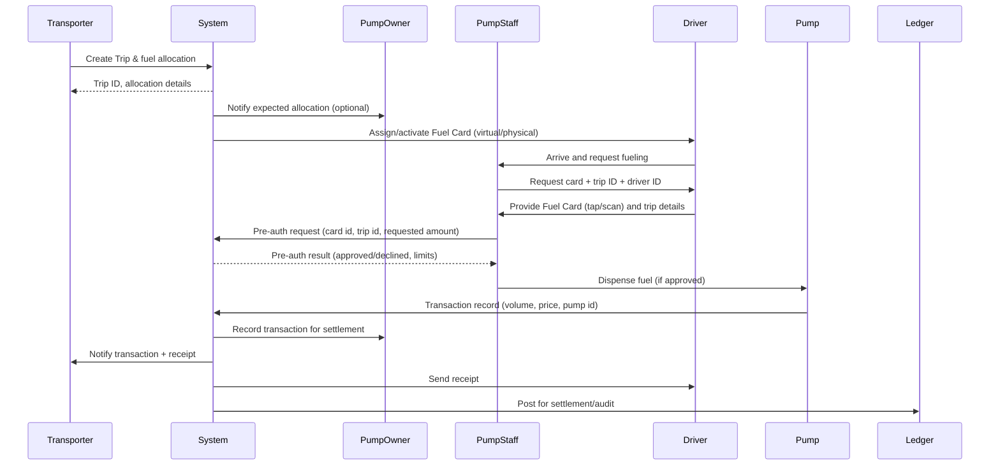

# Pump & Fuel-Card Flow: Pump Owner, Pump Staff, Transporter, Driver

## Overview
This document describes how the Pump Owner, Pump Staff, Transporter, and Driver interact, and how the Fuel Card is used within the system. It covers request → fulfillment → settlement → audit, including normal and error paths.

## Actors
- Pump Owner: owns/manages the fuel station and sees settlements, reports, and limits.
- Pump Staff: on-site operator who authorizes and dispenses fuel at the pump.
- Transporter: company that schedules deliveries and assigns drivers.
- Driver: vehicle operator who collects fuel using the Fuel Card.
- System (API): orchestrates requests, verifies permissions, records transactions, and triggers settlements and notifications.

## Goals
- Ensure authorized, auditable fuel dispensing.
- Associate fuel transactions with trips, drivers, and transporters.
- Enforce card limits, manage top-ups, and support dispute resolution.

## High-level Flow (Steps)
1. Trip creation: Transporter or system creates a `Trip` and associates a driver and vehicle.
2. Fuel request / Allocation: Trip or Transporter requests fuel allocation (volume / amount / limits).
3. Card assignment: System issues or assigns a Fuel Card to the Driver/Trip (virtual or physical).
4. Pre-authorization: System checks card state, balance, limits, and pump permissions.
5. At pump: Driver visits Pump; Pump Staff authenticates Driver and Fuel Card.
6. Dispense: Pump Staff authorizes dispensing; pump sends transaction details to System.
7. Transaction verification: System validates amount, card, trip, odometer (if provided), and logs transaction.
8. Receipt & notification: System issues receipt to Transporter/Driver and notifies Pump Owner for settlement.
9. Settlement & audit: System posts transaction to ledger, updates balances, and creates audit logs.
10. Reconciliation & disputes: Exceptions are flagged for review, with evidence (receipt, timestamps, odometer).

## Detailed Interaction Sequence (Mermaid)

## Fuel Card: Lifecycle & Usage
- Issuance: Card can be physical or virtual. Issued by System and linked to Transporter, Driver, or Trip.
- Activation: Card must be activated (one-time OTP / admin action) before use.
- Limits: Card-level limits may include daily/weekly amount, volume cap, per-transaction cap, approved pump list, and allowed time windows.
- Top-up / Balance: Cards can be pre-funded or invoiced. System tracks balance and available limits.
- Payment flow: At pump, a pre-auth checks limit; final capture posts the actual amount. System decrements balance and records ledger entries.
- Security: PIN, OTP, or Pump Staff authentication may be required. System can block cards on suspected fraud.

## Edge Cases & Error Handling
- Insufficient balance / limit exceeded: PumpStaff receives decline; driver cannot dispense until resolved.
- Card blocked / revoked: System rejects pre-auth; record reasons and notify transporter and pump owner.
- Offline pump: Pump records local transaction; upon reconnection, it pushes transaction to System for verification and reconciliation; flagged until verified.
- Discrepancy in amount: Transaction is flagged and moved to dispute workflow — requires pump receipt + timestamp + staff id.

## Settlement & Reporting
- Settlement frequency can be per-transaction, daily, or periodic per agreement.
- Pump Owner receives daily summary and settlement details (fees, volumes, adjustments).
- Transporter receives consolidated invoices per transporter account.
- Audit logs capture: who initiated, who approved, timestamps, odometer, receipts, and transaction IDs.

## Minimal API / Data Points (for integration)
- Entities: Trip, Driver, Transporter, Pump, PumpStaff, FuelCard, Transaction, Settlement, AuditLog.
- Key fields: `tripId`, `driverId`, `transporterId`, `pumpId`, `cardId`, `amount`, `volume`, `timestamp`, `odometer`, `receiptImage`, `status`, `settlementId`.

## Best Practices / Recommendations
- Require Pump Staff authentication per transaction for traceability.
- Enforce per-trip and per-driver limits to reduce fraud exposure.
- Store receipt images and odometer for dispute resolution.
- Provide clear notifications to Transporter and Pump Owner on exceptions.

## Next Steps / Customization
- Add role-specific UI flows and screenshots.
- Add more granular mermaid diagrams (error flows, settlement flow).
- Tie the flow to concrete API endpoints for implementation.

---
Created for Porttivo API documentation. Review and tell me if you'd like diagrams expanded or field-level API mappings.
